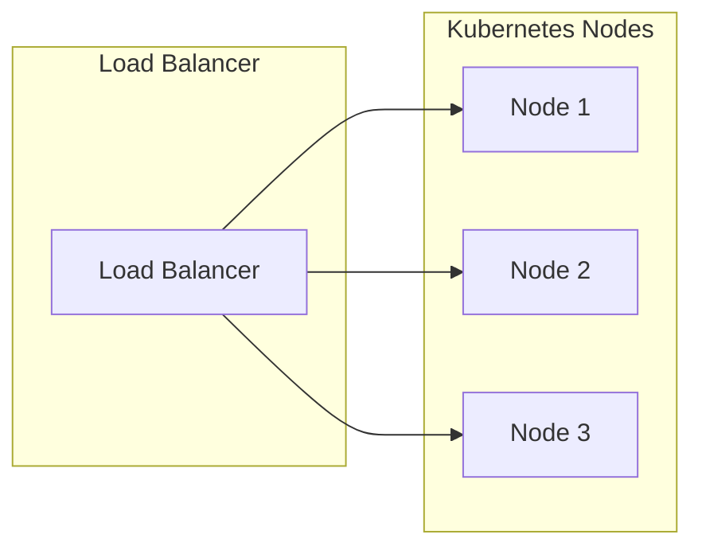
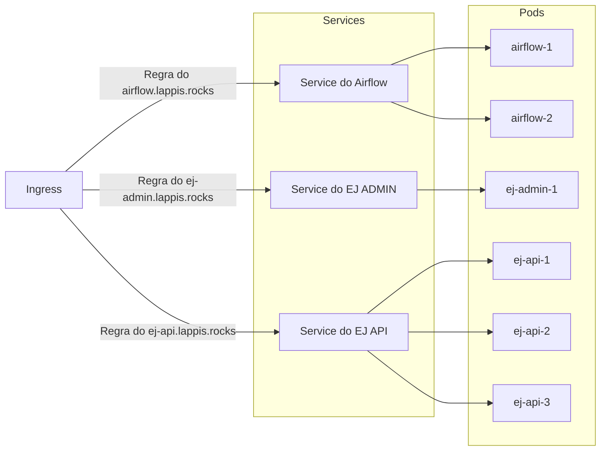

# Nginx

Usos do Nginx neste contexto.

## Load Balancer Externo

O seguinte Load Balancer pode ser um Nginx, um AWS ALB, um Azure Load Balancer ou outro Load Balancer.

## `ingress-nginx`

Uso comum do `ingress-nginx` dentro de um cluster Kubernetes.

